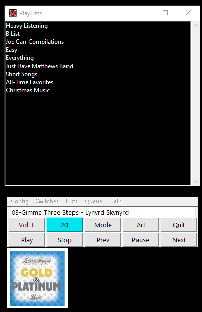
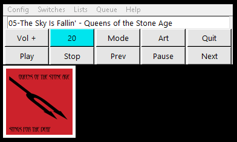

# MMC4W - Minimal MPD Client for Windows

## In a world with tons of music apps, MMC4W stands alone.

**MMC4W** is first and foremost **Minimal**.  That means it does what I need and nothing more.  

**MMC4W** is a MPD Client.  To be clear, you must have access to a running MPD server for this app to be of any value to you.

MMC4W is open source, and does not send any data out to anyone anywhere.  It connects only to the MPD server you specify in the configuration file. (mmc4w.ini)

It takes up very little room on my screen. The interface contains the basic required buttons to control a MPD server:

- Vol +, Vol -, Play, Stop, Prev, Pause, Next and Quit.
- A 'Mode' button eliminates the Windows title bar if desired.
- An 'Art' button toggles a very small window that displays embedded album art.  
    - If no embedded art is found, MMC4W's logo is displayed.

The **'File'** menu contains these functions:

- Configure - opens mmc4w.ini for editing. Uses Windows configured .ini editor. (Notepad or similar)
- Select Server - Allows you to select a server from the list in mmc4w.ini. Prompts you to select a playlist also.
- Exit - Same as the 'Quit' button: exits the app.

There is a **'Look'** menu that has these functions:

- Turn Random On
- Turn Random Off
- Toggle Titlebar
- Reload Current Title
- Set Non-Standard Port

### Some Things MMC4W Does NOT Do:

- Constantly poll the server. - Based on song duration, **MMC4W** checks back with the server when the song is ending.
- Discover servers.  You need to know the IP address of any servers you wish to control.
- Search the music database.  **MMC4W** is a playlist-based app.  You select the playlist you want to listen to and it plays it.
- Update the MPD database.  There are many other ways to do that.  It could be an option later, but for now, no.
- Edit tags, display lyrics, get art from the web, display artist info, provide stats on servers, wash dishes or vacuum floors.

## First Run Process

MMC4W ships with a blank .ini file.  The first time you run it, it will pop up a box like this:

When you press the 'OK' button, **mmc4w** opens mmc4w.ini using the default Windows text editor.  On my system it's Notepad++.  If you never specified an editor for .ini files, you will likely be informed of that fact at this point.

**Notepad** is perfectly fine for this job.  Word processors like **Microsoft Word** or **Wordpad** will cause you problems.  

Do not use a word processor.  Only use a text editor that edits and saves plain ASCII text.

You need to type in your preferred MPD server's IP address in the [basic] section as shown.  Be sure to put that trailing comma on there.

If you have more than one server, just string those IP addresses together as seen there.

Don't worry about the playlists or ports.  Type your server info in the [basic] section, save and close the file.

Restart **MMC4W**.  Go to the **File** menu and click **Select Server**.  You'll be prompted to select one of the servers you just put into the **mmc4w.ini** file.  Click on one.

Next you are prompted to select one of that server's playlists.  Click on it.  Now you can click the **'Play'** button.

### Normal Operation

After you press **'Play'**, there's not much to do but enjoy the music.

MMC4W will show you these basic statistics, alternating between the two lines of text shown in these two images:

The **'Art'** button toggles the small album art window.

The **'Mode'** button toggles the titlebar like this:

### Other Random Options

Logging can be enabled by typing "warning" here:

The resulting log file (**mmc4w.log**) can be found in the **_internal** folder in the installation folder.  The log file is deleted and started fresh each time you start **MMC4W**.  If you remove **warning** from the .ini file, the last log file will remain until you delete it or create a new one.

Under the **'Look'** menu there are options to turn **Random Mode** on or off.

The **'Set Non-Standard Port'** option opens a pop-up that provides the details to set any port other than 6600 which is the default MPD port.

## Notes About What Happens Under the Hood

When you press '**Play**', MMC4W reaches out to the configured server and asks for data on the current song.  Then it asks for a status report.  From the returned data, MMC4W calculates how much longer the current song should be playing.  If album art is being displayed, it attempts to get art embedded in the song.  If that is successful, it displays the art.  If not, it displays the MMC4W logo.

MMC4W uses the Python **threading** module to run a timer in conjunction with a small set of global variables.  In this way we're able to keep the interface satisfactorily snappy and avoid having to poll the server every few seconds to determine if a new song is playing.

The Tkinter interface runs continuously waiting for button presses.  Blocking code (like sleep(10)) is avoided at all cost.  As a result, things work.  From my chair, it's perfect.  We'll see how long that perspective lasts, shan't we?

The design of this utility is intentionally simple.  I'm sure there are several 'better' ways it can be done, I just don't know what they are.  Every once in a blue moon some little thing might get out of sync.  Don't cry, just restart it.  Boom! Done.

### Minutia

MMC4W was developed and tested in Windows 10.  My MPD library is made up exclusively of FLAC files.  I rip my CD's (remember those?) using [Music Bee](https://getmusicbee.com/).  I create a 'folder.jpg' file for each album and embed the art in the songs using Music Bee.  I highly recommend Music Bee!

I hope you enjoy using this as much as I do.  

  --------------------------------------------  
**MMC4W** is written in Python and complied using Pyinstaller.  The Windows installer is built using the Inno Setup Compiler. 
**Many thanks** to bauripalash (Palash Bauri) for [tkhtmlview](https://github.com/bauripalash/tkhtmlview), which makes this help file window look so good! &copy;2023-2024 - Gregory A. Sanders (dr.gerg@drgerg.com)
